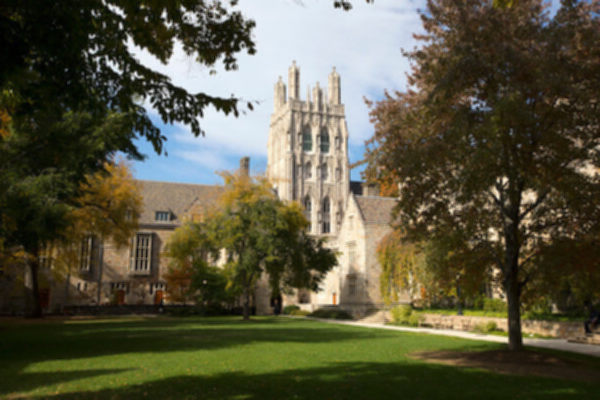
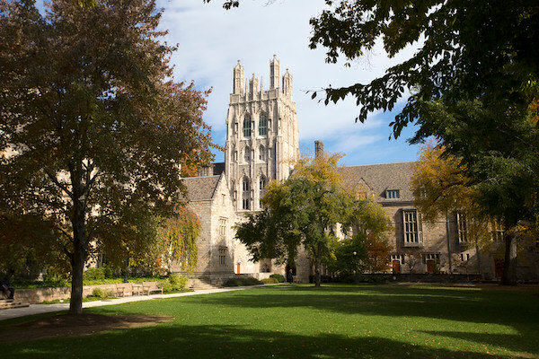

# Image-Filter
Program takes as input a .bmp image and a filter argument, then applies the selected filter to the image. Options are r, b, s, and g (reflection, blur, sepia, and grayscale). I.e. ./filter -r IMAGE.bmp REFLECTED.bmp

Specification: https://cs50.harvard.edu/x/2023/psets/4/filter/less/

Original:

Blurred:

Reflected:

Sepia:

Greyscale:
![Greyscale courtyard](./images/courtyard_greyscale.bmp
